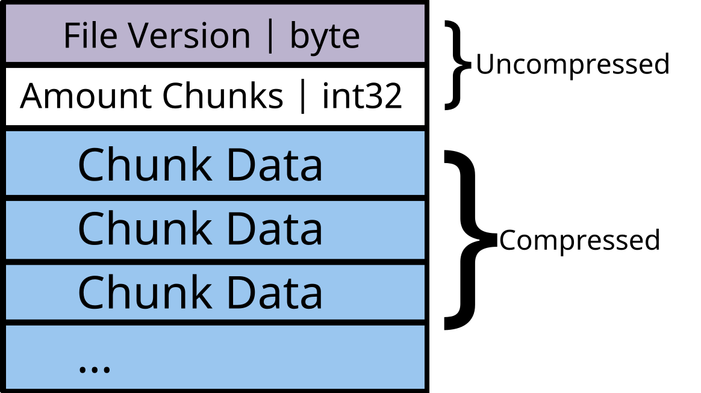
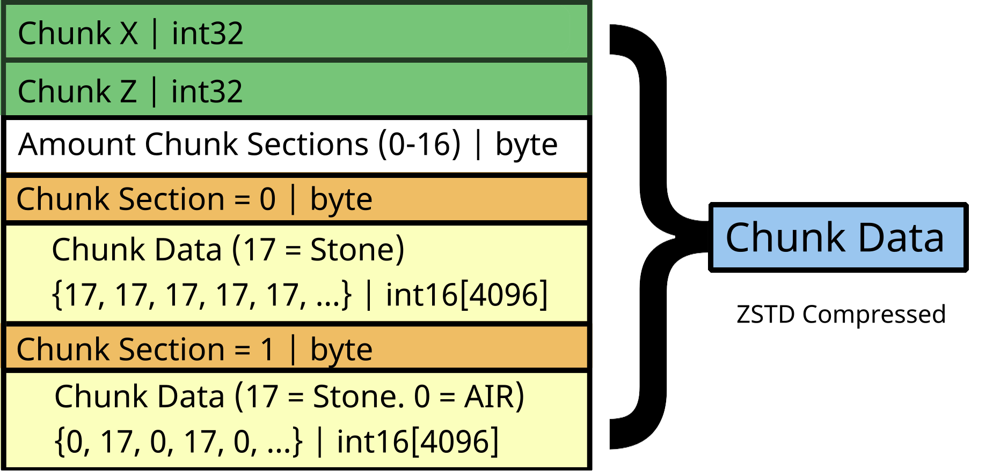

<h1>MinWorld</h1>

    Minimal world format (.minworld)
    Only store blocks id  

 
<h1>How is made?</h1>
<ul>
    <li>The file format contains a header</li>
    <li>(Header = Version of file)</li>
    <li>Amount of chunks to read</li>
    <li>Chunks data</li>
</ul>

<h2>How is chunk data stored?</h2>
<ol>
    <li>
        <h3>Header:</h3>
        
Compressed X and Z.

        
Example: X: 4 and Z: 2

        
Compressed: X << 32 | Z - First 32 bits = X and other = Z
 
    </li>
    <li>
        <h3>Amount chunks sections</h3>
        
Byte that represent amount of valid section in chunk

        
(Valid section = no empty section, with blocks)

    </li>
    <li>
        <h3>Chunk sections:</h3>
        
ID: a byte in range of (0-16)

        
A array of int16, contains all block data

    </li>
</ol>

